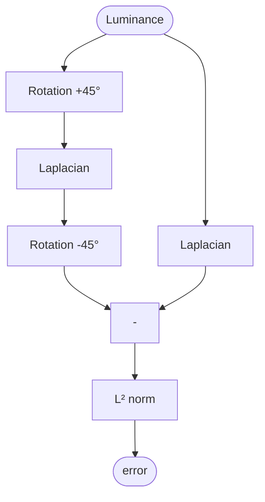
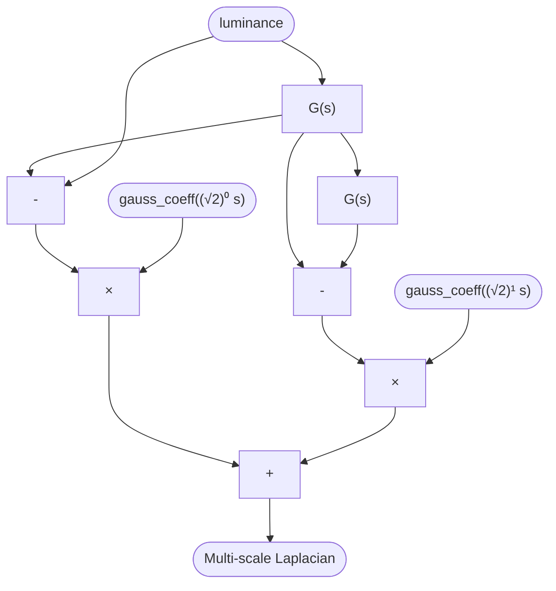

# Rotation-invariant Laplacian for 2D grids, and applications

[toc]

## State of the art

The Laplacian operator $\Delta u$ is the divergence of the second-order partial derivative $\nabla^2 u$ of a multivariate function, which represents the local curvature of this function. This operator is widely used for edge-detection[^1], as well as in partial-differential equations (Poisson, etc.), and other problems of machine-learning minimisation. For numerical applications in orthogonal graphs, sampled only at integer coordinates (like pixels in an image), a discrete Laplacian has to be used, and several approaches are mostly used, that will be detailed hereafter.

### Second-order anisotropic finite differences

These finite differences are computed along the principal directions ($x, y$) of the grid :

$$
\Delta u = \frac{\partial^2 u}{\partial x^2} + \frac{\partial^2 u}{\partial y^2} = \left(\frac{u(x-h, y) + u(x+h, y) + u(x, y - h) + u(x, y + h) - 4 u(x, y)}{h}\right)_{h \rightarrow 0}
$$

where $h$ is the discretisation, usually 1 or 2. This can be rewritten into a 2D convolutional kernel ($*$ denotes the convolution product) : 

$$
\Delta u = u * \frac{1}{h^2}
\begin{bmatrix}
0 & 1 & 0 \\
1 & -4 & 1 \\
0 & 1 & 0
\end{bmatrix}
\label{kernel-anisotropic}
$$

This method has the benefit of being reasonably fast to evaluate, however this kernel is not isotropic. While suitable for slowly varying functions, it becomes unstable for quickly varying ones, especially when $u$ is a sensor reading corrupted by noise. More importantly, the resolution and the orientation of the 2D sampling grid will change the evaluation of the Laplacian, which yields a more philosophical problem : if the sampled data grid is supposed to represent some physical reality, any manipulation on said grid should be defined in terms of the reality it represents rather than in terms of its data shape, and therefore be as independent as possible from the data layout. Said otherwise, any numerical evaluation should solely care about the *latent* image rather than the actual pixels sample, that sampling forming a mere *view* of the reality, regardless of the reality itself, while reality is our actual end-goal.

As an illustration, let us try it on Vermeer's [*Art of Painting*](https://commons.wikimedia.org/wiki/File:Jan_Vermeer_-_The_Art_of_Painting_-_Google_Art_Project.jpg), scanned at 2281×1920 px.[^4]:


See the [Annex](#annex) below for the preparation of the image into a luminance map. Here is the absolute value of the Laplacian computed on luminance along the principal directions with the kernel $\eqref{kernel-anisotropic}$, enhanced for legibility :


Notice the mosaiced pattern in smooth areas, especially on the bright background wall. To evaluate the rotation-invariance of the discrete Laplacian, we use the following scheme :



The rotated output get correlated against the non-rotated one to match the pixel locality between both outputs, and the edge pixels (first and last row and column) are discarded to remove boundary effects. The rotations use cubic spline interpolation with a spline prefilter. The $L^2$ norm of the error between the rotated and non-rotated variants is 152, see the quadratic error map below :


For reproduction, here is the Python code used for this comparison (utility functions and imports are given in the [Annex](#annex)) :

```python
K = np.array([[0.,  1., 0.],
              [1., -4., 1.],
              [0.,  1., 0.]])

grad_direct = signal.convolve2d(im, K, boundary='fill', mode='valid')

im_rot = rotate(im, 45)
grad_indirect = signal.convolve2d(im_rot, K, boundary='fill', mode='valid')
grad_indirect = rotate(grad_indirect, -45)
grad_indirect = correlate(grad_direct, grad_indirect)
diff = grad_indirect - grad_direct
print(np.linalg.norm(diff))

plt.figure(1)
plt.axis('off')
plt.imshow(apply_gamma(diff**2), cmap="Greys_r")
plt.savefig("anisotropic-laplacian-error.jpg", bbox_inches="tight", pil_kwargs={'optimize': True})

plt.figure(2)
plt.axis('off')
plt.imshow(apply_gamma(np.abs(grad_direct)), cmap="Greys_r")
plt.savefig("anisotropic-laplacian.jpg", bbox_inches="tight", pil_kwargs={'optimize': True})
```

### Second-order isotropic finite differences

The core idea of the isotropic second order finite differences is to regularise the anisotropic finite difference on the nearest neighbours with the contribution of the next nearest neighbours. Using Taylor-Young expansions, one can correct the discrete Laplacian to introduce the contribution of the next neighbours.[^2]

In 1988, Oono and Puri[^3] proposed : 
$$
\Delta u = u * \frac{1}{h^2}
\begin{bmatrix}
0.25 & 0.5 & 0.25 \\
0.5 & -3 & 0.5 \\
0.25 & 0.5 & 0.25
\end{bmatrix}
$$
Another kernel, somewhat similar, known as the Mehrstellen discretisation, had been proposed in 1966 :[^6]
$$
\Delta u = u * 
\begin{bmatrix}
1/6 & 2/3   & 1/6 \\
2/3 & -10/3 & 2/3 \\
1/6 & 2/3   & 1/6
\end{bmatrix}
$$
Re-using the same image as above, here is the output of the isotropic Laplacian (the code stays the same except for the values of the kernel `K`) :

|                                                              | Oono & Puri (1986)                                           | Mehrstellen (1966)                                           |
| ------------------------------------------------------------ | ------------------------------------------------------------ | ------------------------------------------------------------ |
| Laplacian output                                             |  |  |
| Quadratic error map between rotated and non-rotated variants |  |  |
| $L^2$ error norm across rotation                             | 118                                                          | 128                                                          |

The $L^2$ norm of the difference between both variants is 15. As expected, both methods perform better than the anisotropic version, regarding rotation invariance, but the Oono & Puri variant has a slight edge. The source code is similar to the previous section, only the kernel `K` is updated.

### Higher order isotropic finite differences

The second order isotropic finite differences have a truncation error $\frac{h^2}{12}\Delta^2 u + \mathcal{O}(h^2)$[^5]. We can lower this error by using higher order finite differences, with 5×5 kernels. In 2005, Patra and Karttunen[^5] proposed two higher-order isotropic discretisations :
$$
\Delta u = u * \frac{1}{15h^2}
\begin{bmatrix}
-1/8 &  0 &     -1 &  0 & -1/8 \\
   0 &  2 &     16 &  2 &    0 \\
  -1 & 16 & -135/2 & 16 &   -1 \\
   0 &  2 &     16 &  2 &    0 \\
-1/8 &  0 &     -1 &  0 & -1/8
\end{bmatrix} \label{high-order-1}
$$

$$
\Delta u = u * \frac{1}{15h^2}
\begin{bmatrix}
0    & -1/2 & -1/4 & -1/2 &    0 \\
-1/2 &    4 &   13 &    4 & -1/2 \\
-1/4 &   13 &  -63 &   13 & -1/4 \\
-1/2 &    4 &   13 &    4 & -1/2 \\
0    & -1/2 & -1/4 & -1/2 &    0
\end{bmatrix} \label{high-order-2}
$$

For reproduction, here are the Python-formatted matrices, so you just have to copy-paste them :

```python
K_h_1 = np.array([[-1/120,     0, -1/15,     0, -1/120],
                  [     0,  2/15, 16/15,  2/15,      0],
                  [ -1/15, 16/15,  -9/2, 16/15,  -1/15],
                  [     0,  2/15, 16/15,  2/15,      0],
                  [-1/120,     0, -1/15,     0, -1/120]])

K_h_2 = np.array([[    0, -1/30, -1/60, -1/30,     0],
                  [-1/30,  4/15, 13/15,  4/15, -1/30],
                  [-1/60, 13/15, -21/5, 13/15, -1/60],
                  [-1/30,  4/15, 13/15,  4/15, -1/30],
                  [    0, -1/30, -1/60, -1/30,     0]])
```

|                                                             | Isotropic high-order kernel $\eqref{high-order-1}$           | Isotropic high-order $\eqref{high-order-2}$                  |
| ----------------------------------------------------------- | ------------------------------------------------------------ | ------------------------------------------------------------ |
| Laplacian output                                            |  |  |
| Quadratic error map between rotated an non-rotated variants |  |  |
| $L^2$ error norm across rotation                            | 154                                                          | 146                                                          |

The $L^2$ norm of the difference between both variants is 14. The rotation $L^2$ error is actually worse than the isotropic 2^nd^ order and even worse than the anisotropic kernel for $\eqref{high-order-1}$. These methods might have a truncation error $\frac{h^2}{90} \Delta^2 u + \mathcal{O}(h^6)$, but they are more challenged by rotations.

### Difference with a Gaussian

Many implementations assume $\Delta u \approx u * G - u$, where $G$ is a Gaussian kernel of standard deviation $\sigma = 1$, with kernel coefficients such that :
$$
G(i, j) = 
\dfrac{1}{2 \pi \sigma^2} e^{-\frac{i^2+j^2}{2 \sigma^2}}
$$
Unfortunately, the Gaussian function has infinite convergence, and convolutional kernels have to be limited in width, so their width is usually chosen such that $(i, j) < (\lfloor 3 \sigma \rfloor, \lfloor 3 \sigma \rfloor) \in \mathbb{N}$, which covers 99.73 % of the Gaussian integral surface, or else using $2 \sigma$ instead covers 95.45 % and requires to normalise the kernel by the sum of its elements such that the kernel is unitary and the energy of the signal is preserved through the convolution. For this reason, a B-spline with binomial coefficients $G = \begin{bmatrix}1 & 4 & 6 & 4 & 1 \end{bmatrix} / 16$ is often preferred : it best approximates a Gaussian of standard deviation $1.0553651328015339$ with an $L^2$ error norm of $0.015788399413758907$ and has finite support.

<iframe src="http://eng.aurelienpierre.com/wp-content/uploads/sites/8/2021/03/binomial-gaussian.html"></iframe><script src="https://cdnjs.cloudflare.com/ajax/libs/plotly.js/1.58.4/plotly-basic.min.js"></script>

Let us compute the Gaussian-based Laplacian for a standard deviation $\sigma = 1.058595$, and then again for $2 \sigma$. The $\sigma$ value is chosen to match the binomial B spline as close as possible, so both implementations could be used :

|                                                              | Gaussian($1\sigma$)                                          | Gaussian($2\sigma$)                                          |
| ------------------------------------------------------------ | ------------------------------------------------------------ | ------------------------------------------------------------ |
| Laplacian output                                             |  |  |
| Quadratic error map between rotated and non-rotated variants |  |  |
| $L^2$ error norm across rotation                             | 31                                                           | 35                                                           |

The Gaussian function being radial by nature, it comes at no surprise that we get the lowest rotational error here. However, we are quite far from a true Laplacian, because the relative $L^2$ error of this method compared to any other discrete Laplacian above is between 99 and 155. We also notice that the rotational error increases as the standard deviation increases, but the error compared to original Laplacians decreases.

Here is the Python code for reproduction :

```python
sigma = 1.0553651328015339

grad_direct = -im + gaussian_filter(im, sigma, mode="constant", order=0, truncate=4)

im_rot = rotate(im, 45)
grad_indirect = -im_rot + gaussian_filter(im_rot, sigma, mode="constant", order=0, truncate=4)
grad_indirect = rotate(grad_indirect, -45)
grad_indirect = correlate(grad_direct, grad_indirect)
diff = grad_indirect[1:-1, 1:-1] - grad_direct[1:-1, 1:-1]
print(np.linalg.norm(diff))

plt.figure(1)
plt.axis('off')
plt.imshow(apply_gamma(diff**2), cmap="Greys_r")
plt.savefig("gaussian-laplacian-error.jpg", bbox_inches="tight", pil_kwargs={'optimize': True})

plt.figure(2)
plt.axis('off')
plt.imshow(apply_gamma(np.abs(grad_direct)), cmap="Greys_r")
plt.savefig("gaussian-laplacian.jpg", bbox_inches="tight", pil_kwargs={'optimize': True})

```

### Conclusion on the state of the art

Since we don't have a ground-truth discrete Laplacian to compare against, the most we can do is to compare the methods between each other.

Matrix of covariance between all methods (all values are $\cdot 10^{-3}$):

||Anisotropic 2^nd^ order|Isotropic 2^nd^ order Oono & Puri|Isotropic 4^th^ order $ \eqref{high-order-2}$|Difference with Gaussian($1 \sigma$)|Difference with Gaussian($ 2 \sigma$)|
|--|--|--|--|--|--|
|Anisotropic 2^nd^ order| 7.63 | 6.15 | **8.32**                                      | 1.86 | 2.20 |
|Isotropic Oono & Puri| 6.15                | 5.13 | 6.83 | 1.57 | 1.90 |
|Isotropic 4^th^ order $\eqref{high-order-2}$| **8.32**            | 6.83                   | **9.18** | 2.06 | 2.43 |
|Difference with Gaussian($1 \sigma$)| 1.86                    | 1.57                    | 2.06                                     | 0.50 | 0.64 |
|Difference with Gaussian($2 \sigma$)| 2.20                | 1.90                    | 2.43                                      | 0.64                             | 0.92 |

Matrix of $L^2$ norms of the relative error between all methods :
|| Anisotropic 2^nd^ order | Isotropic 2^nd^ order Oono & Puri | Isotropic 4^th^ order $ \eqref{high-order-2}$ | Difference with Gaussian($1 \sigma$) | Difference with Gaussian($ 2 \sigma$) |
|--|--|--|--|--|--|
|Anisotropic 2^nd^ order|0       |44  |**28** |139 |135 |
|Isotropic 2^nd^ Oono & Puri|44|   0      | 53 |104 | 99 |
|Isotropic 4^th^ order $ \eqref{high-order-2}$|**28** | 53  | 0      |156 |151|
|Difference with Gaussian($1 \sigma$)|139| 104 | 156 |   0       |25|
|Difference with Gaussian($ 2 \sigma$)|135 | 99 | 151 | 25 | 0 |

We notice all the discrete Laplacian methods have between each other a relative $L^2$ error between 28 and 53, which is about a quarter to an half of the rotational error of the best-performing discretisations. We shall expect rotational errors of the same magnitude as the relative errors between all discretisation methods if those methods were truly isotropic. Covariances lie between $6\cdot 10^{-3}$ and $10 \cdot 10^{-3}$, which is surprisingly low. 

The 4^th^ order isotropic discretisation has the best correlation with the others as well as the highest variance, which is a good sign regarding its accuracy, but the fact that it lies the closest from the anisotropic discretisation and has one of the worst rotational invariance raises questions regarding its real isotropic nature. 

However, regarding the Gaussian method, the error $L^2$ is about twice to three times as high as the other methods. It shows a weak correlation to the others too, but its best correlation is with the 4^th^ order isotropic discretisation.

The rest of this article will be about refining the Gaussian approach to better match discrete Laplacians while retaining the low rotational error.

## Improving the Gaussian approach

### Scaling coefficient

Let us redefine the Laplacian from the difference of a Gaussian $G$ by : 
$$
\Delta u = K(u - u * G)
$$
On the example above, $K$ has been implicitly set to $-1$ to match the sign of other discrete Laplacians. However, the magnitude of the constant is wrong. Expanding $u$ in Taylor series, we get :
$$
u(i, j)_0 = u_0 + \left( \frac{\partial u}{\partial i} \right)_0 i + \left( \frac{\partial u}{\partial j} \right)_0 j + \frac{1}{2} \left[ \left( \frac{\partial^2 u}{\partial i^2} \right)_0 i^2 + \left( \frac{\partial^2 u}{\partial j^2} \right)_0 j^2 \right] + \left( \frac{\partial^2 u}{\partial i \partial j} \right)_0 ij + … \label{taylor}
$$
Then, the continuous convolution filter of $u$ by $G$, the Gaussian centred in $0$ of parameter $\sigma$ is :
$$
u * G = \frac{1}{2 \pi \sigma^2} \iint_{-a / 2}^{a / 2} u(i, j) \cdot e^{- \frac{i^2 + j^2}{2 \sigma^2}}\, \mathrm{d}i \, \mathrm{d}j \label{filter}
$$
where $a$ is the filter width, theoretically infinite, but practically $a \geq 6 \sigma$. Replacing $u(i, j)$ by $\eqref{taylor}$ in the integral $\eqref{filter}$, odd functions like $\iint_{-a/2}^{a/2} i \, \mathrm{d}i \, \mathrm{d}j = 0$ so they don't contribute to the filter. For even functions, like $i^2$, we need to solve the integral, and assuming $a = 8 \sigma \rightarrow \infty$ :
$$
\begin{align}
\iint_{-a/2}^{a/2} i^2 \cdot e^{-\frac{i^2}{2 \sigma^2}} \cdot e^{-\frac{j^2}{2 \sigma^2}}\, \mathrm{d}i \, \mathrm{d}j 
&= \int_{-a/2}^{a/2} e^{-\frac{j^2}{2 \sigma^2}} \, \mathrm{d}j \, \cdot \int_{-a/2}^{a/2} i^2 \cdot e^{-\frac{i^2}{2 \sigma^2}} \, \mathrm{d}i \nonumber \\
&= \sqrt{2 \pi \sigma^2} \, \cdot \, \frac{1}{2}\sqrt{8 \pi \sigma^6} \nonumber \\
&= \frac{\sqrt{16 \pi}}{2}  \sigma^4
\end{align}
$$
Doing the same for $j^2$, we get a new version of $\eqref{filter}$ : 
$$
\begin{align}
(u * G)_0 
&= u_0 + \frac{\sqrt{16 \pi}\sigma^4}{2} × \frac{1}{2 \pi \sigma^2} × \frac{1}{2}\left[ \left( \frac{\partial^2 u}{\partial i^2} \right)_0 + \left( \frac{\partial^2 u}{\partial j^2} \right)_0\right] \nonumber \\
&= u_0 + \frac{\sqrt{\pi} \sigma^2}{2 \pi} \Delta u_0 \nonumber \\
\Rightarrow \Delta u_0 &= \frac{2 \pi}{\sqrt{\pi} \sigma^2}((u * G)_0 - u_0)
\end{align}
$$
Therefore, by identification, $K = \pm\frac{2 \pi}{\sqrt{\pi} \sigma^2}$, the sign depending on whether we want to match the discrete Laplacian operators. Notice that $K \geq 1$ if $\sigma \leq \sqrt{\frac{2 \pi}{\sqrt{\pi}}} < 1.89$, so for small standard deviations we risk not only to turn the Gaussian into a unit impulse instead of a local average, but also we may amplify this wrong average. 

The result of this method, reusing $\sigma = 1.0553651328015339 $ for compatibility with the B spline approach, is :


The quadratic error mask gives :


Now, let us study the influence of varying the $\sigma$ parameter, between $\sigma / 4$ and $ 3 \sigma$ :

<iframe src="http://eng.aurelienpierre.com/wp-content/uploads/sites/8/2021/03/gaussian-discretisation.html"></iframe><script src="https://cdnjs.cloudflare.com/ajax/libs/plotly.js/1.58.4/plotly-basic.min.js"></script>

The Laplacian error is computed as the $L^2$ norm of relative errors with :

* the 2^nd^ order anisotropic discretisation,
* the 2^nd^ order isotropic discretisation from Oono & Puri,
* the 4^th^ order isotropic discretisation given in $\eqref{high-order-2}$.

Then, the global error is the $L^2$ norm of the Laplacian error and the rotational error. 

The variance is given as a metric of the filter sensitivity, since the Laplacian operator acts as a "local anomaly" detector. We have seen above, in the conclusion about the state of the art, that the most accurate method (4^th^ order isotropic) yields the highest variance, which seems a useful property of a such high-pass filter. However, the peak variance is correlated with the peak rotational error, which could be explained by the highest sensitivity being reached when no low-pass effect arises, and the lack of low-pass filtering is what makes this filter very sensible to discretisation discrepancies as well. The peak variance is also correlated with the peak Laplacian error, which would suggest the Gaussian is not isotropic either at this value.

So it appears that, rather than trying to match our *scaled difference with a Gaussian* method against other Laplace discretisations, our end goal should be to maximise the variance at the output of the filter while keeping the rotational error under control, for which the Gaussian framework gives us an obvious trade-off setting in the form of the $\sigma$ parameter. 

The graph above shows 4 particular locii :

* the local maximum of all curves, variance and errors, centred around $\sigma = 0.562267$, 
* two local minima of the Laplacian error function, at $\sigma = 0.395$ and $\sigma = 0.895$,
* the point where the Laplacian error is equal to the rotational error, at $\sigma = 1.0518535$.

Let us analyse them in detail.

Matrix of covariance (all values are $\cdot 10^{-3}$):


|                                       | Anisotropic 2^nd^ order | Isotropic 2^nd^ order Oono & Puri | Isotropic 4^th^ order $ \eqref{high-order-2}$ | Scaled difference with $G(0.395)$ | Scaled difference with $G(0.562267)$ | Scaled difference with $G(0.895)$ | Scaled difference with $G(1.0518535)$ |
| ------------------------------------- | ----------------------- | --------------------------------- | --------------------------------------------- | --------------------------------- | ------------------------------------ | --------------------------------- | ------------------------------------- |
| Scaled difference with $G(0.395)$     | 6.32                    | 5.12                              | 6.90                                          | 5.23                              | 9.24                                 | 5.33                              | 4.94                                  |
| Scaled difference with $G(0.562267)$  | **11.14**               | **9.15**                          | **12.26**                                     | 9.24                              | **16.42**                            | 9.59                              | 8.90                                  |
| Scaled difference with $G(0.895)$     | 6.40                    | 5.40                              | 7.10                                          | 5.33                              | 9.59                                 | 5.86                              | 5.46                                  |
| Scaled difference with $G(1.0518535)$ | 5.93                    | 5.02                              | 6.58                                          | 4.94                              | 8.90                                 | 5.46                              | 5.09                                  |

Matrix of relative $L^2$ error :

|                                       | Anisotropic 2^nd^ order | Isotropic 2^nd^ order Oono & Puri | Isotropic 4^th^ order $ \eqref{high-order-2}$ | Laplacian $L^2$ error norm | Rotational $L^2$ error norm | Global $L^2$ error norm |
| ------------------------------------- | ----------------------- | --------------------------------- | --------------------------------------------- | -------------------------- | --------------------------- | ----------------------- |
| Scaled difference with $G(0.395)$     | **32**                  | **24**                            | **52**                                        | **66**                     | 117                         | **134**                 |
| Scaled difference with $G(0.562267)$  | 88                      | 119                               | 69                                            | 163                        | 200                         | 258                     |
| Scaled difference with $G(0.895)$     | 55                      | 28                                | 60                                            | 86                         | 129                         | 155                     |
| Scaled difference with $G(1.0518535)$ | 61                      | 29                                | 70                                            | 97                         | **100**                     | 139                     |

The Laplacian $L^2$ error norm is computed as the norm of all the other errors (from the 3 left-most columns). The global $L^2$ error norm is computed from the Laplacian and the rotational error norms.

So it appears that we are left with two candidates : 

* $\sigma = 0.395$ if close conformity to classic discrete Laplacians is required. This values also yields a rotational error lower than any discrete Laplacian (but not by much).
* $\sigma = 1.0518535$ if a balanced trade-off between rotation-invariance and conformity to discrete Laplacians is required.

Both yield a rather low variance. 

### Multi-scale iterative scheme

Considering the image as a multi-scale collection of gradients, we can process the Laplacian at increasingly coarser scales and collect the contribution of each scale as a linear combination, weighted with the coefficient computed in the previous section. To do so, we use a wavelet decomposition scheme :



Only the two first scales have been represented on the graph, where the Gaussian standard deviation $\sigma$ is denoted `s` for compatibility. So we apply an iterative blur step at each scale $s$, of the same standard deviation $\sigma$, and compute the corresponding Laplacian such that :
$$
\Delta u_s = K_s(\sigma)(\bar{u}_{s-1} - \bar{u}_s)
$$
At the first scale $s = 0$, we initialise $\bar{u}_{s-1} = u$ and $\bar{u}_0(i, j) = 
\dfrac{1}{2 \pi \sigma^2}\sum_{x = - \lfloor 4 \sigma_s \rfloor}^{+ \lfloor 4 \sigma_s \rfloor}\sum_{y = - \lfloor 4 \sigma_s \rfloor}^{+ \lfloor 4 \sigma_s \rfloor} u(i + x, j + y) \cdot e^{-\frac{x^2 + y^2}{2 \sigma_s^2}}$. Then, for any next scale : 
$$
\bar{u}_s(i, j) = 
\dfrac{1}{2 \pi \sigma^2}\sum_{x = - \lfloor 4 \sigma_s \rfloor}^{+ \lfloor 4 \sigma_s \rfloor}\sum_{y = - \lfloor 4 \sigma_s \rfloor}^{+ \lfloor 4 \sigma_s \rfloor} \bar{u}_{s - 1}(i + x, j + y) \cdot e^{-\frac{x^2 + y^2}{2 \sigma_s^2}}
$$
Because we stack blurs on top of each other, scale after scale, with constant $\sigma$, and because the convolution product of two Gaussians $G(\sigma_1)$ and $G(\sigma_2)$ is another $G\left(\sqrt{\sigma_1^2 + \sigma_2^2}\right)$ [^7], the standard deviation at scale $s$ is $\sigma_s = \sqrt{2}^s \sigma$, so the scaling coefficient at scale $s$ becomes :
$$
K_s(\sigma) = \frac{2 \pi}{\sqrt{\pi} \left( \sqrt{2}^s \sigma \right)^2} = K(\sqrt{2}^s \sigma)
$$

```python
def gauss_coeff(sigma):
    return (2. * np.pi / (np.sqrt(np.pi) * sigma**2))

def find_details_density(im):
    result = np.zeros_like(im)
    
    sigma = 1.0518535
    im_copy = im.copy()
    
    for i in range(5):
        blur = gaussian_filter(im_copy, sigma, mode="constant", order=0, truncate=4)
        result += gauss_coeff(np.sqrt(2)**i * sigma) * (blur - im_copy)
        im_copy = blur

    return result
```


## Pretty pictures

Test pic : 


Find edges with $s = 12$ and $K = \frac{ 2 \pi}{\sqrt{\pi} \sigma^2}$ :


Find edges with $s = 12$ and $K = 1$ :


Find edges with $K = 1$ and $s = 3$ :


Find edges with discrete laplacian by orthogonal 2^nd^  order finite differences of the gaussian scales with $s = 12$ :


## Annex

Find here the utility functions called in the code snippets above :

```python
import numpy as np
from PIL import Image
from matplotlib import pyplot as plt
from scipy.ndimage import gaussian_filter, median_filter, rotate
from scipy import signal

def find_luminance_density(im):
    # convert linear Rec709/sRGB to Y of CIE XYZ 1931 2° standard observer
    return 0.2126 * linear[:, :, 0] + 0.7152 * linear[:, :, 1] + 0.0722 * linear[:, :, 2]

def remove_gamma(im):
    # remove gamma assuming sRGB encoding and output linear RGB
    return (im <= 0.04045) * im / 12.92 + (im > 0.04045) * ((im + 0.055) / (1 + 0.055))**2.4

def apply_gamma(im):
    # apply sRGB gamma back and output non-linear
    return (im <= 0.0031308) * im * 12.92 + (im > 0.0031308) * (1.055 * im**(1 / 2.4) - 0.055)

def correlate(ref_mat, test_mat):
    # trim and align test_mat, array padded for rotations, to match ref_mat, reference array
    y_rot, x_rot = test_mat.shape
    y, x = ref_mat.shape

    x_off = int((x_rot - x) / 2)
    y_off = int((y_rot - y) / 2)

    return test_mat[y_off:y_off + y, x_off:x_off + x]

# Open image and convert to luminance
image = Image.open('Jan_Vermeer_-_The_Art_of_Painting_-_Google_Art_Project.jpg').convert('RGB')
im = np.asarray(image) / 255.
im = find_luminance_density(remove_gamma(im))

# Display luminance for control
plt.axis('off')
plt.imshow(apply_gamma(im), cmap="Greys_r")
plt.savefig("luminance.jpg", bbox_inches="tight", pil_kwargs={'optimize': True})
```

Output (luminance) :


[^1]: YOUNG, Richard A. [The Gaussian derivative model for spatial vision. I- Retinal mechanisms](https://www.researchgate.net/profile/Richard-Young-12/publication/20001242_The_Gaussian_derivative_model_for_spatial_vision_I_Retinal_mechanisms/links/5a159a174585153b546c8f2e/The-Gaussian-derivative-model-for-spatial-vision-I-Retinal-mechanisms.pdf). *Spatial vision*. 1987. Vol. 2, no. 4, p. 273–293.
[^2]:  PROVATAS, Nikolas and ELDER, Ken. [Phase-Field Methods in Materials Science and Engineering](http://www.physics.mcgill.ca/~provatas/papers/Phase_Field_Methods_text.pdf). Wiley-VCH Verlag GmbH & Co. KGaA, 2010, p. 219.
[^3]: OONO, Yoshitsugu et PURI, Sanjay. [Study of phase-separation dynamics by use of cell dynamical systems. I. Modeling.](http://repository.ias.ac.in/32406/1/32406.pdf) *Physical Review A*, 1988, vol. 38, no 1, p. 434.
[^4]: VERMEER, Jan Vermeer. The Art of Painting (1666-1668). Google Art Project, 2012. <https://commons.wikimedia.org/wiki/File:Jan_Vermeer_-_The_Art_of_Painting_-_Google_Art_Project.jpg
[^5]: PATRA, Michael et KARTTUNEN, Mikko. Stencils with isotropic discretization error for differential operators. *Numerical Methods for Partial Differential Equations: An International Journal*, 2006, vol. 22, no 4, p. 936-953.
[^6]:  COLLATZ, Lotha. The Numerical Treatment of Differential Equations, Springer-Verlag, Berlin-Heidelberg-NewYork, 1966.
[^7]: BROMILEY, Paul. [Products and convolutions of Gaussian probability density functions](https://citeseerx.ist.psu.edu/viewdoc/download?doi=10.1.1.583.3007&rep=rep1&type=pdf). *Tina-Vision Memo*, 2003, vol. 3, no 4, p. 1. 