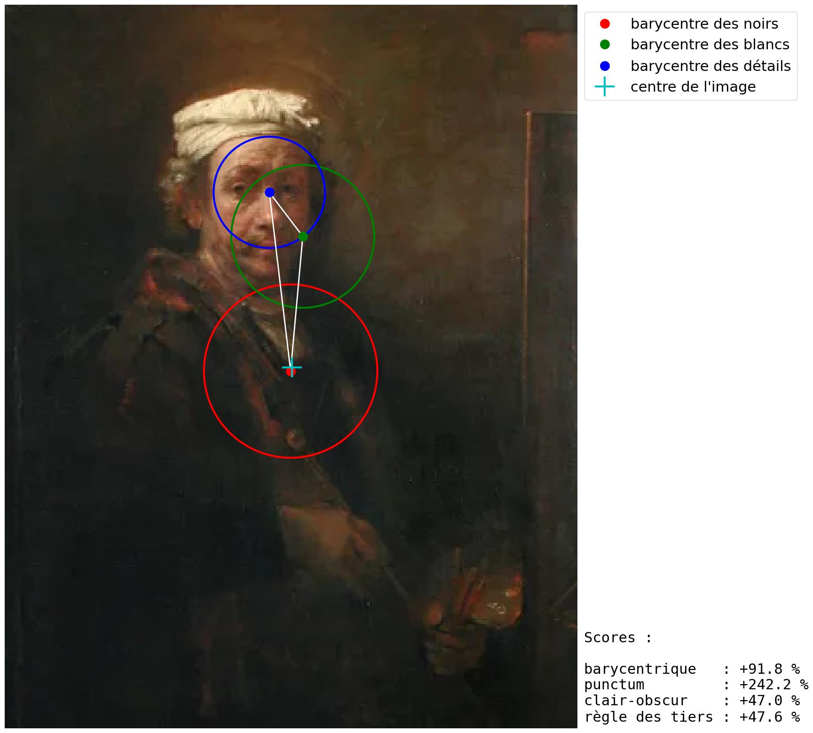

## Dépasser la règle des tiers : triangle barycentrique et punctum

[toc]

## Introduction

La composition est l’art de disposer les éléments graphiques dans une image pour en signifier le sens et pour guider l’œil à travers la surface de l’œuvre. 

Il a été démontré que la structure de la composition influence le balayage visuel du spectateur dans l’image, mais de façon différente pour les spectateurs ayant reçu une éducation artistique et ceux n’en ayant pas reçu. [^1] Tandis que les spectateurs non-entraînés se focalisent sur les objets individuels et sur leurs détails, les autres suivent spontanément les lignes internes à l’image qui relient spatialement et sémantiquement les différents objets, d’autant plus facilement que la composition est formellement équilibrée, structurée et donc symétrique.

La perception humaine repose entièrement sur le contraste. Un objet blanc illuminé uniformément, sur un fond blanc illuminé uniformément, est invisible. Pour le voir, on a besoin d'introduire des ombres, qui vont créer du contraste (différences locales de luminosité), qui va faire apparaître des contours, à partir desquels le cerveau identifie une forme, puis la mémoire l'associe à un objet déjà rencontré.

Si la perception repose sur le contraste, une œuvre graphique peut donc se décomposer en deux masses : une masse de blanc et une masse de noir. Dans la vie courante, intuitivement, on sait que des objets pesants ont un centre de gravité, c'est à dire une sorte de centre d'équilibre autour duquel leur matière est répartie de façon uniforme.

Des recherches en psychologie de l'esthétique ont montré que les sujets ont tendance à préférer des distributions graphiques homogènes : on préfère une assiette disposée de façon homogène, on préfère un bouquet de fleurs uniformément réparti, et même si on peut chercher à éviter une symétrie géométrique (version primaire de l'homogénéité), on recherche tout de même une homogénéité globale, en moyenne (voir les jardins à l'anglaise). Cette homogénéité non géométrique est difficile à apprécier par des moyens autres que l'intuition.

*Note : toutes les snippets de code fournis ci-dessous utilisent le langage Python et la librairie de calcul matriciel Numpy. Veillez à commencer votre programme par :*

```python
import numpy as np
```

## Méthode proposée

### Densités

L'image RGB est réduite à sa luminance relative, soit le canal Y de l'espace CIE XYZ 1931 pour l'observateur standard 2°. Depuis l'espace ITU-R BT.709 sRGB linéaire, utilisé pour encoder la quasi-totalité des fichiers images disponibles sur internet, la conversion $RGB \rightarrow Y$ est donnée, dans un espace linéaire normalisé entre 0 et 1, par[^3] :
$$
Y = 0.2126 \cdot R + 0.7152 \cdot G + 0.0722 \cdot B
$$
$R, G, B$ doivent au préalable être linéarisés, c'est à dire que la fonction de transfert électro-optique *(EOTF)* de l'espace sRGB, aussi nommée gamma dans le milieu de la gestion des couleurs, doit être inversée. Cette étape est souvent ignorée dans la pratique, mais calculer la luminance à partir des valeurs non-linéaires $R^\gamma, G^\gamma, B^\gamma$ est faux dans le domaine de l'équation (1). Il est en effet facile de montrer que : 
$$
(0.2126 \cdot R + 0.7152 \cdot G + 0.0722 \cdot B)^\gamma \neq 0.2126 \cdot R^\gamma + 0.7152 \cdot G^\gamma + 0.0722 \cdot B^\gamma
$$
L'espace sRGB utilise une EOTF composite, définie comme suit : 
$$
[ RGB ]_{linear} = 
\begin{cases}
\dfrac{[R'G'B']}{12.92}, &[R'G'B'] \leq 0.04045 \\
\left( \dfrac{[R'G'B'] + 0.055}{1.055}\right)^{2.4}, &[R'G'B'] > 0.04045
\end{cases}
$$
La fonction de conversion correspondante est :

```python
def luminance(image):
    linear = (image <= 0.04045) * image / 12.92 + (image > 0.04045) * ((image + 0.055) / 1.055)**2.4
    Y = 0.2126 * linear[:, :, 0] + 0.7152 * linear[:, :, 1] + 0.0722 * linear[:, :, 2]
    return Y
```

On définit alors deux densités de luminance, pour chaque pixel de l'image de coordonnées $(i, j)$ :

- une densité des blancs, $D_W(i, j) = Y(i, j)$,
- une densité des noirs, $D_B(i, j) = 1 - Y(i, j)$, par simple inversion de la luminance.

Additionnellement, on cherche une métrique de la densité de détails dans l'image, c'est à dire une norme de la magnitude des hautes fréquences. Pour ce faire, on décomposera l'image en une pyramide de Laplace à $s$ échelles, et on accumulera la somme harmonique de l'énergie du laplacien. 

À chaque échelle $s \geq 0$, le laplacien $\Delta$ de l'image $u$ est ainsi approximé par la différence entre l'image à l'échelle $(s-1)$ et le produit de convolution de $\bar{u}_{s-1}$ par un kernel de Gauss 2D tronqué à $4 \sigma$ :
$$
\Delta u_s \approx K(\bar{u}_s - \bar{u}_{s-1}) \label{laplacien}
$$
où :
$$ {test}
\sigma_s = \sqrt{2} \sigma_{s - 1} \\
\bar{u}_s(i, j) = 
\dfrac{1}{2 \pi \sigma^2}\sum_{x = - \lfloor 4 \sigma_s \rfloor}^{+ \lfloor 4 \sigma_s \rfloor}\sum_{y = - \lfloor 4 \sigma_s \rfloor}^{+ \lfloor 4 \sigma_s \rfloor} \bar{u}_{s - 1}(i + x, j + y) \cdot e^{-\frac{x^2}{2 \sigma_s^2}} \cdot e^{-\frac{y^2}{2 \sigma_s^2}}
$$ {test}
et, pour $s = 0$, on initialise : 
$$
\bar{u}_{s - 1}(i, j) = u_0(i, j)
$$
Le facteur de proportionnalité $K$ peut être déterminé par analyse aux limites en passant par les développements limités en série de Taylor-McLaurin. Si $u_s(i_0, j_0) = u_0$, au voisinage de $(i_0, j_0)$, on a :
$$
u(i, j) = u_0 + \left( \frac{\partial u}{\partial i} \right)_0 i + \left( \frac{\partial u}{\partial j} \right)_0 j + \frac{1}{2} \left[ \left( \frac{\partial^2 u}{\partial i^2} \right)_0 i^2 + \left( \frac{\partial^2 u}{\partial j^2} \right)_0 j^2 \right] + \left( \frac{\partial^2 u}{\partial i \partial j} \right)_0 ij + …
$$
Si l'on calcule $\bar{u}_0$ via le théorème de la valeur moyenne, par intégration continue sur un carré élémentaire de côté $a$, on obtient : 
$$
\bar{u}_0
= \frac{1}{a^2} \iint_{-a / 2}^{a / 2} u(i, j) \, \mathrm{d}i \, \mathrm{d}j
$$
L'intégration des termes impairs donne $\iint_{-a/2}^{a/2} i \, \mathrm{d}i \, \mathrm{d}j = 0$, et seuls les termes pairs contribuent, tels que $\iint_{-a/2}^{a/2} i^2 \, \mathrm{d}i \, \mathrm{d}j = \frac{a^4}{24}$. En remplaçant (7) dans (8), on trouve :
$$
\bar{u}_0 = u_0 + \frac{a^2}{48} \left[ \left( \frac{\partial^2 u}{\partial i^2} \right)_0 + \left( \frac{\partial^2 u}{\partial j^2} \right)_0\right] = u_0 + \frac{a^2}{48} \Delta u_0 \Rightarrow \Delta u_0 = \frac{48}{a^2}(\bar{u}_0 - u_0)
$$
Cependant, la convolution effectuée ici par une fonction gaussienne en 2D équivaut à la moyenne pondérée :
$$
\bar{u}_0
= \frac{1}{2 \pi \sigma^2} \iint_{-a / 2}^{a / 2} u(i, j) \cdot e^{- \frac{x^2 + y^2}{2 \sigma^2}}\, \mathrm{d}i \, \mathrm{d}j
$$
L'intégrale de l'exponentielle gaussienne 2D non-normalisée tend vers $2 \pi \sigma^2$ quand $a \rightarrow \infty$ et l'exponentielle gaussienne est paire. Les termes impairs restent nuls après intégration. 

L'équation $(\ref{laplacien})$ met en évidence la relation entre le laplacien et la courbure locale de $u$ : $\Delta u_s(i, j)$ exprime la déviation entre la moyenne locale de la fonction $u$ et sa valeur locale, c'est à dire sa courbure moyenne locale. Le kernel de convolution permettant le calcul de la moyenne locale peut être changé, en particulier, si un filtre à réponse finie telle qu'une B-spline cardinale à coefficients binomiaux est utilisé , la pyramide de Laplace devient une décomposition en ondelettes cardinales non-décimée, tout en conservant la propriété d'être de carré sommable, qui nous importe pour la suite.

On définit une énergie harmonique de la fonction $u$, dans le même esprit que l'énergie de Dirichlet mais exprimée localement, exprimant la courbure de la fonction $u$ à chaque échelle de la pyramide, telle que :
$$
E_{c}(i, j) = \sum_s | \Delta u_s (i, j)|^2
$$
L'énergie harmonique $E_c(i, j)$ forme alors une carte de la densité de détails dans l'image. Il est ici important de noter que $u$ doit être linéaire pour préserver le caractère physique des gradients et du laplacien,   

```python
from scipy.ndimage import gaussian_filter

def details(image):
    result = np.zeros_like(image)
    sharp = image
    
    diag = (image.shape[0]**2 + image.shape[1]**2)**0.5
    sigma = max(0.001 * diag, 0.25)

    for i in range(8):
        blur = gaussian_filter(sharp, sigma, mode="nearest", truncate=4)
        result += ((blur - sharp) * 48. / (2. * np.pi * sigma**2))**2
        sharp = blur
        sigma *= 2**0.5

    return result
```


### Barycentres

On se propose d'isoler ces deux centres d'inertie, ou centres de masses, par des méthodes numériques, qu'on appellera barycentres pour se détacher de la mécanique. L’équation vectorielle du barycentre $M$, exprimée depuis l’origine $O$ du repère orthonormé direct, d’un corps pesant $\Omega$ de densité $D$ continue et définie en tout point $t \in \Omega$ est donnée par la formule (1) :
$$
\vec{OM} = \dfrac{1}{\int_\Omega{D(\vec{t}) \mathrm{d}\Omega}} \int_\Omega{D(\vec{t}) \cdot \vec{t} \mathrm{d}\Omega}
$$
Dans un espace vectoriel orthonormé, l'intégrale s'applique indépendamment à chaque dimension, si bien qu’on peut la discrétiser dans $\mathbb{R}^2$, pour une image 2D composée de pixels de coordonnées $(i, j)$, par :
$$
\vec{OM} = (x, y) \in \mathbb{R}^2, 
\begin{cases}
x  = \dfrac{1}{m} \sum_{(i, j)\in \Omega} D(i, j) \cdot i \\
y  = \dfrac{1}{m} \sum_{(i, j)\in \Omega} D(i, j) \cdot j
\end{cases}, m = \sum_{(i, j)\in \Omega}D(i, j)
$$
La fonction correspondante à ce calcul est : 

```python
def barycenter(density):
    mass = density.sum()
    ij = np.indices(density.shape)
    integral_x = np.sum(density * ij[0])
    integral_y = np.sum(density * ij[1])
    return (integral_x / mass, integral_y / mass)
```

### Premier moment

On cherche ensuite à exprimer la concentration de masse autour des barycentres. Cette métrique est donnée par le premier moment d’inertie 

### Barycentres des luminosités

Ceci va donc nous donner une métrique de l'équilibre entre les blancs et les noirs. La distance barycentrique entre les barycentres des blancs et des noirs indique la tension dans l'image : elle sera plus importante par exemple pour des paysages, où la séparation ciel/terre induit naturellement un clivage lumineux dans l'image.

L'axe barycentrique entre les blancs et les noirs a deux propriétés intéressantes :

* il passe toujours par le centre de l'image,
* il indique la direction de la lumière principale (le fall-off)

Le premier moment des noirs et des blancs indique la répartition spatiale de chaque masse de luminosité. Le clair-obscur reposant essentiellement sur l'émergence d'une masse lumineuse, se détachant d'une ambiance sombre, on peut donc calculer un score de clair-obscur par simple division des premiers moments (1 - blancs / noirs).


À noter : la règle des tiers originale, définie par Sir Joshua Reynolds en 1783, concernait non pas la disposition géométrique des éléments dans l'image, mais l'équilibre entre les zones claires et les zones sombres. Un facteur de clair-obscur de 33 % indique donc le respect de la règle originale, encore que Reynolds ne l'ait pas formellement quantifiée (c'est John Thomas Smith, en 1797, qui nous pond les tiers et généralise la règle à la composition).

### Barycentre des détails

On cherche alors un troisième barycentre : celui des détails. Les détails sont les zones nettes et texturées, de hautes fréquences, présentes dans l'image. Ce troisième barycentre est souvent aligné sur l'axe des deux précédents, ou très proche, mais pas toujours. On peut créer un score de barycentrisme, qui sera l'aire du triangle formé par les trois barycentres.

De la même manière, on peut calculer le premier moment des détails, c'est à dire la distance moyenne des détails autour de leur barycentre, et en sortir un score de punctum (au sens de Roland Barthes) : le lieu vers lequel le regard est dirigé. Ce punctum se trouve généralement très proche du centre de l'image.

Une mise en garde, cependant, concernant les détails : le grain argentique, le bruit numérique et les altérations de surface des peintures sont également des hautes fréquences qui vont fausser le calcul du barycentre et du premier moment des détails. Une étape de préfiltrage du bruit est appliquée par le code avant le calcul des détails, mais il est possible d'accentuer le débruitage si besoin en utilisant l'argument `-n` (voir plus bas).


## Règle des tiers

Concernant le score de règle des tiers, on génère un masque de grille des tiers élargi, et on calcule un score de respect à partir de la sommation de deux termes :

* un terme de corrélation, qui cherche dans l'image des éléments géométriques parallèles aux guides des tiers et des éléments circulaires au niveau de leurs points d'intersection. Ce terme évalue le respect de la règle des tiers « stricte » qui vise à caler la ligne d'horizon, les yeux, ou d'autres éléments géométriques au niveau des lignes guides, mais n'est pas applicable pour des images organiques sans éléments géométriques (souvent artificiels).
* un terme de détail, qui calcule la proportion de détails, dans l'image, présente autour des lignes guides des tiers. Ce terme évalue le respect de la règle des tiers « souple », qui vise à positionner approximativement les éléments non géométriques autour des tiers.

Le score maximal de respect de la règle des tiers est obtenu en calculant le score… d'une grille en tiers, soit 100 % :


En pratique, de nombreuses images censées respecter la règle des tiers obtiennent d'assez mauvais scores, et il faudra au moins un score de 25 % pour accepter la règle des tiers dans une image :


## Interprétation

Tout ceci vise à montrer que la règle des tiers n'est rien d'autre qu'un artifice pour tenter d'écarter les objets du centre de l'image, mais ne vise absolument pas à « décenter » le sujet. En réalité, les barycentres seront presque toujours centrés, ce qui veut dire que le but maladroit de la règle des tiers est d'avantage de faire « respirer » la scène, en répartissant les objets dans le cadre, mais toujours en gardant une homogénéité centrale.

Chez Rembrandt, on voit d'ailleurs très souvent le barycentre des noirs en plein sur le centre de l'image, ce qui traduit une ombre « enveloppante » qui sert à faire ressortir le sujet, dans la lumière. Le sujet peut être, lui, associé à un barycentre des blancs et des détails très excentré.



Un score barycentrique faible associé à un score de règle des tiers élevé trahit l'application bête et méchante de la règle des tiers au détriment du sujet princial, et donc la plupart du temps, une composition déséquilibrée.


## Utiliser le script

Il suffit d'exécuter :

```python
python visual-barycenter.py XXX
```

où `XXX` peut être soit un fichier, par exemple `image.jpg`, soit un répertoire, par exemple `Rembrandt`.

Arguments optionnels :

* `-h` affiche l'aide,
* `-t` superpose dans l'image les lignes guides de la règle des tiers,
* `-g` superpose dans l'image les lignes guides de la règle du nombre d'or,
* `-v` enregistre les images intermédiaires,
* `-n X` définit le diamètre du débruitage, en pixels, où `X` est un entier supérieur à 2. Par défaut, le débruitage est effectué sur 3 pixels.

Le script enregistre un `rapport.txt` dans le dossier source de ou des image(s) contenant les statistiques.


## Résultats

Sous la forme `(moyenne ± écart-type)`. Un écart-type proche de zéro indique une moyenne fiable car les valeurs sont fortement centrées autour de cette moyenne. Un écart-type supérieur à la moyenne signale que la moyenne n'a aucune valeur représentative.

### Divers amateurs

```
score barycentrique.......................................... (84.64 ± 13.18) %
score de punctum............................................. (91.34 ± 3.38) %
score de clair-obscur........................................ (73.13 ± 139.60) %
score de la règle des tiers.................................. (22.54 ± 6.01) %
```

### Ramelli

```
score barycentrique.......................................... (89.74 ± 12.63) %
score de punctum............................................. (86.74 ± 2.39) %
score de clair-obscur........................................ (32.02 ± 26.58) %
score de la règle des tiers.................................. (20.67 ± 3.88) %
```

### Rembrandt

```
score barycentrique.......................................... (94.03 ± 8.73) %
score de punctum............................................. (90.53 ± 8.07) %
score de clair-obscur........................................ (63.53 ± 34.87) %
score de la règle des tiers.................................. (16.88 ± 4.15) %
```

### Vermeer

```
score barycentrique.......................................... (90.55 ± 13.38) %
score de punctum............................................. (89.73 ± 2.74) %
score de clair-obscur........................................ (44.13 ± 39.77) %
score de la règle des tiers.................................. (19.79 ± 5.26) %
```

### Titien

```
score barycentrique.......................................... (94.03 ± 6.24) %
score de punctum............................................. (87.51 ± 3.37) %
score de clair-obscur........................................ (30.56 ± 30.40) %
score de la règle des tiers.................................. (16.99 ± 4.33) %
```

### Vinci

```
score barycentrique.......................................... (92.19 ± 11.64) %
score de punctum............................................. (88.42 ± 3.18) %
score de clair-obscur........................................ (31.94 ± 27.67) %
score de la règle des tiers.................................. (19.26 ± 4.23) %
```

### Cartier-Bresson

```
score barycentrique.......................................... (93.42 ± 6.43) %
score de punctum............................................. (84.63 ± 4.47) %
score de clair-obscur........................................ (1.21 ± 16.46) %
score de la règle des tiers.................................. (17.47 ± 2.27) %
```

### Salgado

```
score barycentrique.......................................... (93.32 ± 9.14) %
score de punctum............................................. (86.57 ± 2.52) %
score de clair-obscur........................................ (14.72 ± 9.30) %
score de la règle des tiers.................................. (19.13 ± 2.11) %
```

### Sieff

```
score barycentrique.......................................... (96.37 ± 3.59) %
score de punctum............................................. (88.62 ± 3.68) %
score de clair-obscur........................................ (40.65 ± 31.01) %
score de la règle des tiers.................................. (19.47 ± 2.90) %
```

### Newton

```
score barycentrique.......................................... (91.80 ± 15.37) %
score de punctum............................................. (86.66 ± 2.94) %
score de clair-obscur........................................ (18.00 ± 38.11) %
score de la règle des tiers.................................. (19.53 ± 2.89) %
```

### Lindbergh

```
score barycentrique.......................................... (96.03 ± 4.88) %
score de punctum............................................. (89.36 ± 4.09) %
score de clair-obscur........................................ (27.50 ± 44.11) %
score de la règle des tiers.................................. (20.59 ± 2.78) %
```

### Conclusion

1. Ramelli obtient le plus gros score de **règle des tiers** (20.7 %) avec toutefois un écart-type plus haut que les autres, ce qui tendrait à montrer qu'il est le seul à suivre volontairement la règle, avec un succès variable.
2. Les peintres et les photographes obtiennent tous des **scores barycentriques** supérieurs à 92 %, à la seule exception de Vermeer, à 90 %. Ramelli est juste en dessous, à 89.7 %.
3. Sans surprise, Rembrandt obtient le plus gros score de **clair-obscur** (63 %) et de **punctum** (90 %).
4. Salgado et HCB obtiennent les plus petits scores de **punctum**, en raison de leur composition assez larges mais aussi car nombre de leurs photos présentent du grain argentique qui fausse la mesure des détails.
5. Les œuvres qui suivent la règle des tiers géométrique suivent en fait plutôt une règle des 1/3, c'est à dire que seulement l'une des deux lignes guides sur chaque axe reçoit un détail géométrique, et la deuxième est inutilisée. Bon nombre d'œuvres obtiennent des scores autours de 25 % simplement parce que des détails se trouvent au voisinage des lignes guides.

## Références

[^1]:NODINE, Calvin F., LOCHER, Paul J., et KRUPINSKI, Elizabeth A. The role  of formal art training on perception and aesthetic judgment of art  compositions. *Leonardo*, 1993, vol. 26, no 3, p. 219-227. https://doi.org/10.2307/1575815

[^3]: International Electrotechnical Commission. Multimedia systems and requirements - Colour measurement and management - Part 2-1 : Colour management - Default RGB colour space - sRGB. IEC 61966-2-1:1999. https://webstore.iec.ch/publication/6169